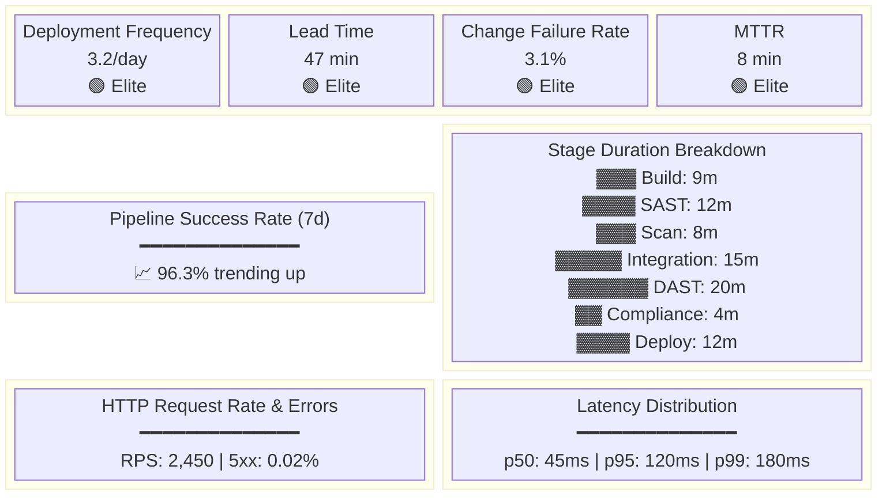
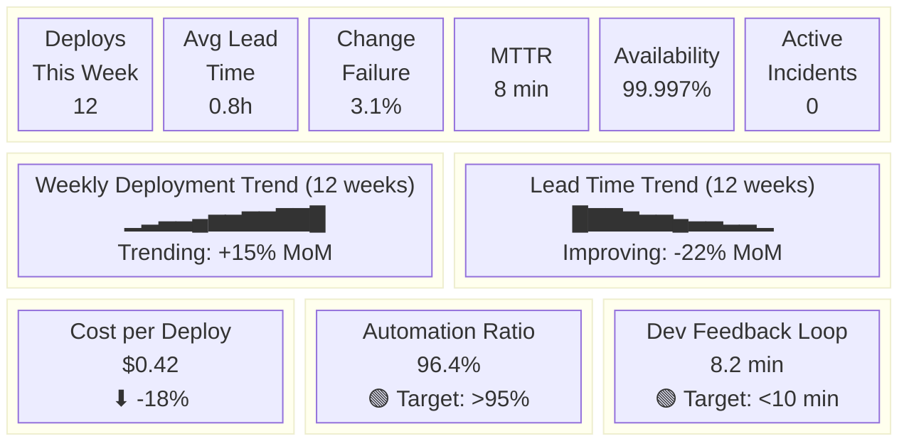
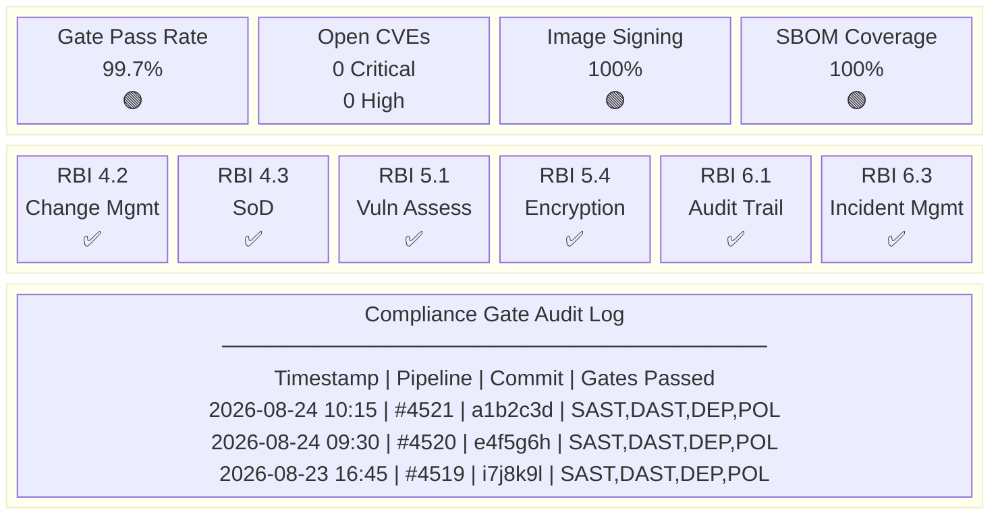

# Dashboard Wireframes — NovaPay Digital Bank

> **AI Attribution Block**: Dashboard wireframes designed with AI-assisted research. Reviewed by Nihal N.

## 1. Engineering Dashboard Wireframe

The Engineering Dashboard provides real-time operational visibility for the SRE and development teams.

### Panel Specifications

| Row | Panels | Data Source | Refresh |
|-----|--------|------------|---------|
| Row 1 | 4x DORA metric stat panels | Prometheus | 30s |
| Row 2 | Pipeline success rate (time series) + Stage durations (bar chart) | Prometheus | 30s |
| Row 3 | HTTP request rate (time series) + Latency percentiles (time series) | Prometheus | 10s |
| Row 4 | Canary analysis status + Active alerts | Prometheus + Alertmanager | 10s |

---

## 2. Management Dashboard Wireframe

The Management Dashboard provides weekly/monthly executive visibility into delivery performance.

### Panel Specifications

| Row | Panels | Audience | Refresh |
|-----|--------|----------|---------|
| Row 1 | 6x KPI stat panels | CTO, VP Engineering | 5m |
| Row 2 | Deployment trend + Lead time trend (12 weeks) | CTO | 1h |
| Row 3 | Cost/deploy + Automation ratio + Developer feedback | VP Engineering | 5m |

---

## 3. Regulatory Dashboard Wireframe

The Regulatory Dashboard provides audit-ready compliance evidence for RBI and PCI-DSS reviews.

### Panel Specifications

| Row | Panels | Audience | Refresh |
|-----|--------|----------|---------|
| Row 1 | 4x compliance KPIs (gauge + stat) | Head of Compliance, RBI Auditor | 1h |
| Row 2 | 6x RBI section compliance status (stat with value mapping) | RBI Auditor | 1h |
| Row 3 | Audit trail log table (Loki data source) | Compliance team | 15m |
| Row 4 | PCI-DSS requirement coverage (table) | PCI-DSS assessor | 1h |
