# Deliverable 1: CI/CD Pipeline Architecture — NovaPay Digital Bank

> **AI Attribution Block**: This document was developed with AI-assisted research and drafting. All architectural decisions, regulatory mappings, and technical specifications were reviewed, validated, and refined by Nihal N. AI tools used: GitHub Copilot, ChatGPT (research assistance).

## 1. Executive Summary

This document defines the production-grade, eight-stage CI/CD pipeline architecture for NovaPay Digital Bank. The pipeline transforms NovaPay from its current state — manual SSH deployments with a 4.5-hour MTTR and 17 RBI audit non-conformances — into an organisation deploying multiple times per day with automated compliance evidence generation, sub-15-minute incident recovery, and five-nines (99.999%) availability.

The architecture enforces **security-by-default** and **compliance-as-code**, ensuring that every code change passing through the pipeline is automatically tested, scanned, signed, policy-validated, and traceable from commit to production deployment.

## 2. Architecture Overview

### 2.1 Pipeline Flow Diagram

```mermaid
flowchart TB
    subgraph "Stage 1: Source Control & Trigger"
        A1[Developer Push / PR] --> A2{Branch Protection<br/>Rules Met?}
        A2 -->|Yes| A3[Signed Commit<br/>Verification]
        A2 -->|No| A4[❌ PR Blocked]
        A3 -->|Valid| A5[Webhook Trigger<br/>Pipeline Start]
        A3 -->|Invalid| A4
    end

    subgraph "Stage 2: Build & Compilation"
        B1[Multi-stage Docker Build] --> B2[Unit Tests + Coverage]
        B2 --> B3{Coverage ≥ 80% line<br/>≥ 70% branch?}
        B3 -->|Yes| B4[Artefact Versioning<br/>SemVer + SHA]
        B3 -->|No| B5[❌ Build Failed]
        B4 --> B6[Push to Artifactory]
    end

    subgraph "Stage 3: SAST"
        C1[SonarQube Scan] --> C2{0 Critical,<br/>≤ 2 High?}
        C2 -->|Yes| C3[✅ SAST Passed]
        C2 -->|No| C4[❌ Pipeline Blocked<br/>Auto-ticket Created]
    end

    subgraph "Stage 4: Dependency & Container Scanning"
        D1[Trivy Image Scan] --> D2[SBOM Generation<br/>CycloneDX]
        D2 --> D3{0 Critical CVE?<br/>No GPL/AGPL?}
        D3 -->|Yes| D4[✅ Scan Passed]
        D3 -->|No| D5[❌ Pipeline Blocked]
        D6[Cosign Image Signing] --> D7[Signed Artefact]
    end

    subgraph "Stage 5: Integration & Contract Testing"
        E1[Ephemeral Namespace<br/>Provisioning] --> E2[Pact Contract Tests]
        E2 --> E3[API Backward<br/>Compatibility Check]
        E3 --> E4[Database Integration<br/>Tests]
        E4 --> E5{All Tests Pass?}
        E5 -->|Yes| E6[✅ Integration Passed]
        E5 -->|No| E7[❌ Pipeline Blocked]
    end

    subgraph "Stage 6: DAST"
        F1[OWASP ZAP<br/>Authenticated Scan] --> F2{0 Critical/High<br/>OWASP Top 10?}
        F2 -->|Yes| F3[✅ DAST Passed]
        F2 -->|No| F4[❌ Pipeline Blocked<br/>Risk Acceptance Form]
    end

    subgraph "Stage 7: Policy & Compliance Gates"
        G1[OPA/Kyverno<br/>K8s Policy Check] --> G2[RBI IT Risk<br/>Codification]
        G2 --> G3[PCI-DSS v4.0<br/>Automated Checks]
        G3 --> G4[Image Provenance<br/>Cosign Verify]
        G4 --> G5[Segregation of Duties<br/>Enforcement]
        G5 --> G6{All Policies Pass?}
        G6 -->|Yes| G7[✅ Compliance Passed]
        G6 -->|No| G8[❌ Deployment Rejected]
    end

    subgraph "Stage 8: Deployment & Verification"
        H1[ArgoCD Sync<br/>Blue-Green / Canary] --> H2[Smoke Tests]
        H2 --> H3[Synthetic Transaction<br/>Monitoring]
        H3 --> H4{Deployment<br/>Success Criteria Met?}
        H4 -->|Yes| H5[✅ Deployment Verified<br/>Production Live]
        H4 -->|No| H6[🔄 Automated Rollback<br/>Triggered]
    end

    A5 --> B1
    B6 --> C1
    B6 --> D1
    C3 --> E1
    D4 --> D6
    D7 --> E1
    E6 --> F1
    F3 --> G1
    G7 --> H1
```



### 2.2 Parallel Execution Strategy

Stages 3 (SAST) and 4 (Dependency & Container Scanning) execute **in parallel** after Stage 2 completes. Both must pass before Stage 5 begins. This parallelisation reduces pipeline duration by approximately 8–12 minutes.

| Execution Block | Stages | Estimated Duration |
|----------------|--------|-------------------|
| Sequential Block 1 | Stage 1: Source Control | 30 seconds |
| Sequential Block 2 | Stage 2: Build & Compilation | 8–12 minutes |
| **Parallel Block** | Stage 3: SAST + Stage 4: Scanning | 10–15 minutes (parallel) |
| Sequential Block 3 | Stage 5: Integration Testing | 12–18 minutes |
| Sequential Block 4 | Stage 6: DAST | 15–25 minutes |
| Sequential Block 5 | Stage 7: Policy & Compliance | 3–5 minutes |
| Sequential Block 6 | Stage 8: Deployment + Verification | 15–30 minutes |
| **Total Pipeline Duration** | | **63–106 minutes (target: < 120 min)** |

> **Parallelisation ratio**: Stages 3 and 4 run in parallel (~15 min saved), yielding **> 40% parallelisation** of the scanning phase. With further optimisation (caching, incremental scans), the pipeline targets consistent sub-90-minute execution.

## 3. Stage Specifications Summary

| # | Stage | Tool | Key Threshold | SLA Target | On Failure |
|---|-------|------|--------------|------------|-----------|
| 1 | Source Control & Trigger | GitHub Enterprise | Signed commits, branch protection | < 30s | PR blocked |
| 2 | Build & Compilation | Gradle + Docker | ≥ 80% line, ≥ 70% branch coverage | < 12 min | Build failed |
| 3 | SAST | SonarQube 10.x | 0 Critical, ≤ 2 High | < 15 min | Pipeline blocked, auto-ticket |
| 4 | Dependency & Container Scan | Trivy 0.50+ / Syft | 0 Critical CVE, SBOM generated | < 10 min | Pipeline blocked |
| 5 | Integration & Contract Testing | Pact 5.x / Testcontainers | 100% contract pass rate | < 18 min | Pipeline blocked |
| 6 | DAST | OWASP ZAP 2.14+ | 0 Critical/High (OWASP Top 10) | < 25 min | Pipeline blocked |
| 7 | Policy & Compliance Gates | OPA / Kyverno / Cosign | All policies pass | < 5 min | Deployment rejected |
| 8 | Deployment & Verification | ArgoCD 2.x / Istio | Smoke tests pass, metrics healthy | < 30 min | Automated rollback |

> Detailed per-stage specifications are in the `stage-details/` directory.

## 4. Branching Strategy

NovaPay adopts **Trunk-Based Development** for high-velocity delivery:

- All developers work on **short-lived feature branches** (< 24 hours)
- Changes merge to `main` via **pull requests** with mandatory code review
- **Signed commits** (GPG/SSH) are enforced via branch protection rules
- **No direct pushes to `main`** — all changes must pass the CI pipeline
- **Emergency hotfix path**: `hotfix/*` branches follow an expedited but not bypassed pipeline (all security and compliance gates still execute)

### Branch Protection Rules

```yaml
# GitHub Branch Protection Configuration
branch_protection:
  main:
    required_pull_request_reviews:
      required_approving_review_count: 2
      dismiss_stale_reviews: true
      require_code_owner_reviews: true
    required_status_checks:
      strict: true
      contexts:
        - "ci/build"
        - "ci/sast"
        - "ci/container-scan"
        - "ci/integration-tests"
        - "ci/dast"
        - "ci/compliance-gates"
    enforce_admins: true
    required_signatures: true
    restrictions:
      users: []
      teams: ["release-managers", "sre-leads"]
```

## 5. Artefact Versioning & Provenance

Every build artefact follows **Semantic Versioning** (SemVer):

```
Format: MAJOR.MINOR.PATCH+build_metadata
Example: 2.14.3+sha.a1b2c3d.build.4521.2026-08-22T10:30:00Z
```

**Container Image Tagging Strategy**:
- SemVer tag: `novapay-app:2.14.3`
- Git SHA tag: `novapay-app:a1b2c3d`
- **Never use `latest` in production**

**Supply Chain Security**:
- Every container image is **signed using Cosign** after build
- Kubernetes admission controller (OPA/Kyverno) **rejects unsigned images**
- SBOM generated in **CycloneDX** format and archived per build
- SLSA Level 2 provenance attestation

## 6. Developer Feedback Loop

The pipeline is designed for fast developer feedback:

| Feedback Type | Time to Developer | Method |
|--------------|------------------|--------|
| Syntax/compile errors | < 2 minutes | Build stage fail |
| Code quality issues | < 10 minutes | SAST results in PR |
| Vulnerability alerts | < 10 minutes | Scanning results in PR |
| Integration failures | < 25 minutes | Test results in PR |
| Security findings | < 40 minutes | DAST results in PR |
| Compliance violations | < 45 minutes | Policy gate results in PR |

## 7. Cross-References

- **Deployment strategies**: See [Deliverable 2](../02-deployment-strategies/deployment-strategies.md)
- **Compliance gate details**: See [Deliverable 3](../03-compliance-gates/compliance-gates.md)
- **Rollback triggers**: See [Deliverable 6](../06-rollback-specification/rollback-specification.md)
- **Observability metrics**: See [Deliverable 8](../08-observability/observability.md)
- **GitHub Actions implementation**: See [CI Pipeline YAML](../../pipeline/.github/workflows/ci-pipeline.yml)
