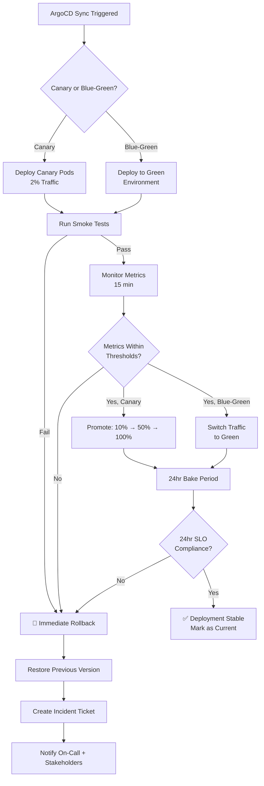

# Stage 8: Deployment & Verification

> **AI Attribution Block**: Developed with AI-assisted research. All specifications reviewed and validated by Nihal N.

## Overview

The final pipeline stage executes the actual deployment to production using ArgoCD with Istio service mesh for traffic management. It supports both blue-green and canary deployment strategies with automated post-deployment verification and rollback capabilities.

## Tool & Version

| Component | Specification |
|-----------|--------------|
| GitOps Engine | ArgoCD 2.x |
| Service Mesh | Istio 1.20+ |
| Traffic Management | Istio VirtualService |
| Smoke Testing | Custom smoke test suite (Gradle) |
| Synthetic Monitoring | Grafana Synthetic Monitoring |
| Deployment Controller | Argo Rollouts 1.6+ |

## Configuration

### ArgoCD Application Manifest

```yaml
apiVersion: argoproj.io/v1alpha1
kind: Application
metadata:
  name: novapay-production
  namespace: argocd
  labels:
    app.kubernetes.io/name: novapay
    compliance-tier: critical
spec:
  project: novapay
  source:
    repoURL: https://github.com/novapay/k8s-manifests
    targetRevision: HEAD
    path: overlays/production
    helm:
      valueFiles:
        - values-production.yaml
  destination:
    server: https://kubernetes.default.svc
    namespace: novapay-prod
  syncPolicy:
    automated:
      prune: true
      selfHeal: true
    syncOptions:
      - CreateNamespace=true
      - PrunePropagationPolicy=foreground
    retry:
      limit: 3
      backoff:
        duration: 5s
        factor: 2
        maxDuration: 3m
```

### Deployment Strategy Selection

```yaml
# Argo Rollouts strategy
apiVersion: argoproj.io/v1alpha1
kind: Rollout
metadata:
  name: novapay-app
  namespace: novapay-prod
spec:
  replicas: 6
  strategy:
    canary:
      canaryService: novapay-app-canary
      stableService: novapay-app-stable
      trafficRouting:
        istio:
          virtualServices:
            - name: novapay-app-vsvc
              routes:
                - primary
      steps:
        - setWeight: 2
        - pause: { duration: 15m }
        - analysis:
            templates:
              - templateName: canary-analysis
            args:
              - name: service-name
                value: novapay-app-canary
        - setWeight: 10
        - pause: { duration: 30m }
        - analysis:
            templates:
              - templateName: canary-analysis
        - setWeight: 50
        - pause: { duration: 60m }
        - analysis:
            templates:
              - templateName: canary-analysis
        - setWeight: 100
      rollbackWindow:
        revisions: 3
      abortScaleDownDelaySeconds: 30
```

### Post-Deployment Smoke Tests

```yaml
smoke_tests:
  - name: "Health Check"
    request:
      method: GET
      url: "/actuator/health"
    expected:
      status: 200
      body_contains: '"status":"UP"'
    timeout: 5s

  - name: "API Authentication"
    request:
      method: POST
      url: "/api/v1/auth/token"
      body: '{"grant_type":"client_credentials"}'
    expected:
      status: 200
      body_contains: "access_token"
    timeout: 10s

  - name: "Database Connectivity"
    request:
      method: GET
      url: "/actuator/health/db"
    expected:
      status: 200
      body_contains: '"database":"UP"'
    timeout: 5s

  - name: "Redis Connectivity"
    request:
      method: GET
      url: "/actuator/health/redis"
    expected:
      status: 200
    timeout: 5s

  - name: "Synthetic Transaction"
    request:
      method: POST
      url: "/api/v1/synthetic/balance-check"
      headers:
        X-Synthetic-Test: "true"
    expected:
      status: 200
    timeout: 15s
```

## Quality Gate (Deployment Success Criteria)

| Check | Threshold | Enforcement |
|-------|-----------|-------------|
| Smoke tests | 100% pass rate | Rollback if failed |
| Pod readiness | All pods Ready within 5 min | Rollback if failed |
| Error rate (HTTP 5xx) | < 0.1% for 15 min post-deploy | Auto-rollback |
| Latency p99 | < 200ms for 15 min post-deploy | Auto-rollback |
| Synthetic transactions | 100% success for 15 min | Auto-rollback |
| Health check | All pods passing liveness + readiness | Auto-rollback |

## Deployment Success Flow



## Failure Modes & Remediation

| Failure | Cause | Remediation |
|---------|-------|-------------|
| Smoke test failure | Application not responding correctly | Auto-rollback, investigate logs |
| Pod CrashLoopBackOff | Application crash on startup | Auto-rollback, check container logs |
| Metrics degradation | Performance regression | Auto-rollback at 2% canary weight |
| ArgoCD sync failure | Manifest error | Fix manifest, re-sync |
| Istio routing error | VirtualService misconfiguration | Restore previous VirtualService |

## SLA Target

| Metric | Target |
|--------|--------|
| Canary deployment (initial 2%) | < 5 minutes |
| Smoke tests | < 3 minutes |
| Full canary promotion | < 2 hours (all phases) |
| Blue-green switch | < 30 seconds |
| Rollback execution | < 60 seconds |
| Total deployment + verification | < 30 minutes (initial) |

## RBI/PCI-DSS Mapping

- **RBI Section 4.2**: Automated deployment with rollback procedures
- **RBI Section 6.1**: Comprehensive audit trails for deployment events
- **RBI Section 6.3**: Business continuity — automated rollback ensures rapid recovery
- **PCI-DSS Req 6.5**: Change management — controlled deployment with verification
