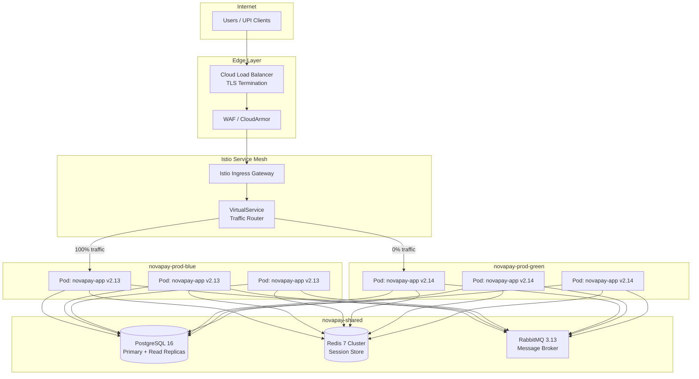
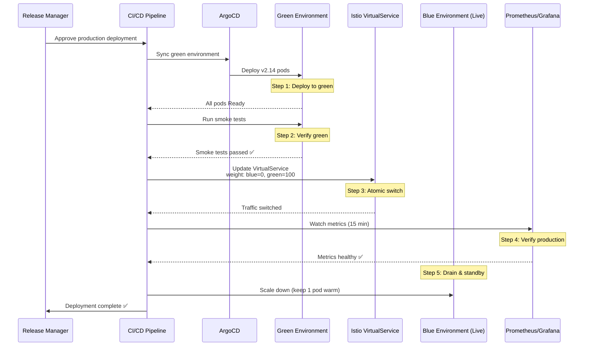
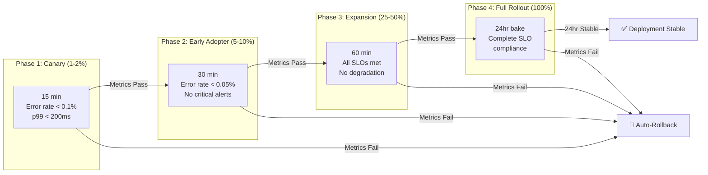

# Deliverable 2: Deployment Strategies — NovaPay Digital Bank

> **AI Attribution Block**: This document was developed with AI-assisted research and drafting. All architectural decisions, regulatory mappings, and technical specifications were reviewed, validated, and refined by Nihal N. AI tools used: GitHub Copilot, ChatGPT (research assistance).

## 1. Executive Summary

This document specifies NovaPay Digital Bank's zero-downtime deployment architecture, implementing both **blue-green** and **canary** deployment strategies on Kubernetes with Istio service mesh. The design ensures uninterrupted UPI transaction processing during deployments, with automated rollback guarantees and statistical analysis for canary promotion decisions.

## 2. Blue-Green Deployment Architecture

### 2.1 Infrastructure Topology



### 2.2 Traffic Switching Protocol (5-Step Sequence)



### 2.3 Istio VirtualService Configuration

```yaml
apiVersion: networking.istio.io/v1beta1
kind: VirtualService
metadata:
  name: novapay-app
  namespace: novapay-prod
spec:
  hosts:
    - novapay.internal
    - api.novapay.com
  gateways:
    - novapay-gateway
  http:
    - match:
        - uri:
            prefix: /api/
      route:
        - destination:
            host: novapay-app-blue
            port:
              number: 8080
          weight: 100
        - destination:
            host: novapay-app-green
            port:
              number: 8080
          weight: 0
      timeout: 30s
      retries:
        attempts: 3
        perTryTimeout: 10s
        retryOn: 5xx,reset,connect-failure,retriable-4xx
```

### 2.4 Session Management with Distributed Redis

```yaml
# Spring Boot session configuration
spring:
  session:
    store-type: redis
    timeout: 30m
    redis:
      namespace: novapay:sessions
  redis:
    cluster:
      nodes:
        - redis-node-1.novapay-shared:6379
        - redis-node-2.novapay-shared:6379
        - redis-node-3.novapay-shared:6379
    password: ${REDIS_PASSWORD}
    ssl: true
```

Both blue and green environments connect to the **same Redis cluster**, ensuring session continuity during traffic switches. Users do not experience session loss.

### 2.5 Connection Draining

```yaml
# Pod disruption and graceful shutdown
spec:
  terminationGracePeriodSeconds: 60
  containers:
    - name: novapay-app
      lifecycle:
        preStop:
          exec:
            command: ["/bin/sh", "-c", "sleep 10"]
      # Spring Boot graceful shutdown
      env:
        - name: SERVER_SHUTDOWN
          value: "graceful"
        - name: SPRING_LIFECYCLE_TIMEOUT_PER_SHUTDOWN_PHASE
          value: "45s"
```

**Draining protocol**:
1. Remove pod from service endpoints (Kubernetes)
2. Wait 10 seconds for in-flight requests to complete (preStop hook)
3. Spring Boot stops accepting new requests
4. Allow 45 seconds for active requests to complete
5. Force terminate if still running after 60 seconds

**Long-running payment transactions**: Payment settlement jobs (up to 5 minutes) use a **dedicated worker deployment** with a separate draining policy (terminationGracePeriodSeconds: 300).

## 3. Canary Deployment Architecture

### 3.1 Four-Phase Canary Progression



| Phase | Traffic % | Duration | Success Criteria | Auto Action |
|-------|-----------|----------|------------------|-------------|
| Canary | 1–2% | 15 min | Error rate < 0.1%, p99 latency < 200ms | Proceed or auto-rollback |
| Early Adopter | 5–10% | 30 min | Error rate < 0.05%, no critical alerts | Proceed or auto-rollback |
| Expansion | 25–50% | 60 min | All SLOs met, no degradation vs baseline | Proceed to full rollout |
| Full Rollout | 100% | 24hr bake | Complete SLO compliance for 24 hours | Mark deployment stable |

### 3.2 Statistical Analysis for Canary Promotion

Automated canary promotion decisions use statistical hypothesis testing against a rolling 7-day production baseline:

#### Latency Comparison: Welch's t-test

```
H₀: μ_canary = μ_baseline  (no significant difference)
H₁: μ_canary > μ_baseline  (canary is slower)

Decision rule:
- If p-value < 0.05 → Reject H₀ → canary is statistically slower → ROLLBACK
- If p-value ≥ 0.05 → Fail to reject H₀ → canary latency acceptable → PROCEED
- Minimum sample size: 1000 requests per version
```

#### Error Rate Comparison: Chi-Squared Test

```
H₀: error_rate_canary = error_rate_baseline
H₁: error_rate_canary > error_rate_baseline

Decision rule:
- If p-value < 0.05 → Reject H₀ → canary has higher error rate → ROLLBACK
- If p-value ≥ 0.05 → Fail to reject H₀ → canary error rate acceptable → PROCEED
- 95% confidence interval for automated promotion
```

#### Multi-Metric Weighted Composite Score

```yaml
composite_score:
  metrics:
    - name: latency_p99
      weight: 0.35
      threshold: 200ms
    - name: error_rate
      weight: 0.35
      threshold: 0.1%
    - name: cpu_utilization
      weight: 0.15
      threshold: 80%
    - name: memory_utilization
      weight: 0.15
      threshold: 85%
  decision:
    promote_threshold: 0.95  # Score must be ≥ 0.95 to auto-promote
    rollback_threshold: 0.70  # Score below 0.70 triggers auto-rollback
    manual_review: 0.70-0.95  # Scores in this range require human decision
```

### 3.3 Argo Rollouts AnalysisTemplate

```yaml
apiVersion: argoproj.io/v1alpha1
kind: AnalysisTemplate
metadata:
  name: canary-analysis
  namespace: novapay-prod
spec:
  args:
    - name: service-name
  metrics:
    - name: error-rate
      interval: 1m
      count: 15
      successCondition: result[0] < 0.001
      failureLimit: 3
      provider:
        prometheus:
          address: http://prometheus.monitoring:9090
          query: |
            sum(rate(http_server_requests_seconds_count{
              service="{{args.service-name}}",
              status=~"5.."
            }[5m])) /
            sum(rate(http_server_requests_seconds_count{
              service="{{args.service-name}}"
            }[5m]))
    
    - name: latency-p99
      interval: 1m
      count: 15
      successCondition: result[0] < 0.200
      failureLimit: 3
      provider:
        prometheus:
          address: http://prometheus.monitoring:9090
          query: |
            histogram_quantile(0.99,
              sum(rate(http_server_requests_seconds_bucket{
                service="{{args.service-name}}"
              }[5m])) by (le)
            )
```

## 4. Deployment Strategy Selection Matrix

| Scenario | Strategy | Rationale |
|----------|----------|-----------|
| Regular feature release | Canary | Gradual rollout with metrics validation |
| Hotfix (SEV-1/SEV-2) | Blue-Green | Fastest possible switch with instant rollback |
| Database schema change | Canary + Blue-Green | Canary validates new code; blue-green for instant rollback |
| Infrastructure change (K8s upgrade) | Blue-Green | Atomic environment switch |
| Configuration change (feature flag) | Neither | Feature flags toggle independently of deployments |

## 5. Deployment Blackout Calendar

No deployments are permitted during these windows:

| Window | Dates/Times | Rationale |
|--------|-------------|-----------|
| Salary days | 1st, 7th, 15th of each month | Peak UPI transaction volume |
| Month-end processing | 28th–31st of each month | Settlement and reconciliation |
| Peak hours | 10 AM–12 PM IST, 5 PM–8 PM IST daily | High transaction volume |
| Major festivals | Diwali, Eid, Christmas, Holi (±2 days) | Exceptional traffic spikes |
| RBI settlement windows | As published by RBI | Regulatory requirement |
| NPCI maintenance | As notified by NPCI | UPI infrastructure dependency |

## 6. Cross-References

- **Pipeline architecture**: See [Deliverable 1](../01-pipeline-architecture/architecture.md)
- **Rollback triggers**: See [Deliverable 6](../06-rollback-specification/rollback-specification.md)
- **Observability metrics**: See [Deliverable 8](../08-observability/observability.md)
- **Database migration during deployment**: See [Deliverable 4](../04-database-migration/database-migration.md)
