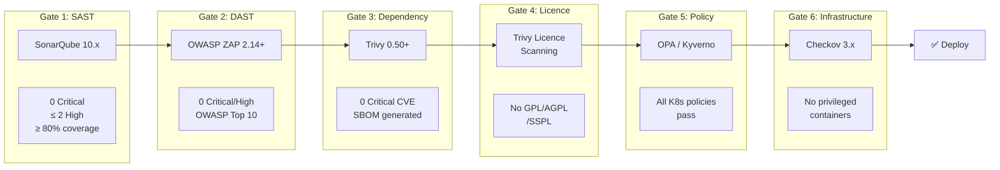

# Deliverable 3: Compliance Gates — NovaPay Digital Bank

> **AI Attribution Block**: This document was developed with AI-assisted research and drafting. All regulatory mappings and technical specifications were reviewed, validated, and refined by Nihal N. AI tools used: GitHub Copilot, ChatGPT (research assistance).

## 1. Executive Summary

This document defines six automated compliance gates integrated into NovaPay's CI/CD pipeline. Each gate enforces specific regulatory requirements from the RBI Master Direction on IT Governance, Risk, Controls and Assurance Practices, PCI-DSS v4.0, and internal segregation of duties policies. Gates are **hard-blocking** — no code reaches production without passing every gate.

## 2. Compliance Gate Architecture



## 3. Gate Specifications

### Gate 1: SAST (Static Application Security Testing)

| Attribute | Value |
|-----------|-------|
| **Tool** | SonarQube 10.x with custom NovaPay Banking profile |
| **Trigger** | After Build stage (Stage 3 in pipeline) |
| **Threshold** | 0 Critical vulnerabilities, ≤ 2 High vulnerabilities, ≥ 80% code coverage |
| **On Failure** | Pipeline blocked, auto-ticket created in Jira |
| **Exception Process** | CISO approval within 24 hours; exception auto-expires after 90 days |
| **Remediation** | Developer fixes vulnerability; security champion reviews fix |
| **Audit Trail** | JSON: `{gate: "SAST", timestamp, scan_id, findings_count, severity_breakdown, decision, approver}` |

**RBI Mapping**: Section 5.1 — "Vulnerability assessment must be performed regularly"
**PCI-DSS Mapping**: Req 6.2 — "Bespoke software security"; Req 6.3 — "Security vulnerabilities"

### Gate 2: DAST (Dynamic Application Security Testing)

| Attribute | Value |
|-----------|-------|
| **Tool** | OWASP ZAP 2.14+ with authenticated scanning |
| **Trigger** | After Integration Testing stage (Stage 6 in pipeline) |
| **Threshold** | 0 Critical and 0 High findings from OWASP Top 10 categories |
| **On Failure** | Pipeline blocked; risk acceptance form required |
| **Exception Process** | Risk acceptance form + TRC notification; dual approval (CISO + Head of Compliance) |
| **Remediation** | Fix vulnerability, redeploy to staging, re-scan |
| **Audit Trail** | JSON: `{gate: "DAST", timestamp, scan_id, urls_scanned, findings, false_positives, decision}` |

**RBI Mapping**: Section 5.1 — "Vulnerability assessment"
**PCI-DSS Mapping**: Req 6.4 — "Public-facing web application protection"; Req 11.3 — "Penetration testing"

### Gate 3: Dependency & Container Scanning

| Attribute | Value |
|-----------|-------|
| **Tool** | Trivy 0.50+ for container and dependency scanning; Syft for SBOM generation |
| **Trigger** | After Build stage, parallel with SAST (Stage 4 in pipeline) |
| **Threshold** | 0 Critical CVEs; block if any CVE has CVSS ≥ 9.0; SBOM must be generated |
| **On Failure** | Pipeline blocked if CVSS ≥ 9.0; 72-hour remediation window for other Critical |
| **Exception Process** | Security engineer files exception with compensating controls; auto-expires 72h (Critical) or 30 days (High) |
| **Remediation** | Update vulnerable dependency; if no fix available, document compensating controls |
| **Audit Trail** | JSON: `{gate: "DEPENDENCY", timestamp, image_ref, cve_count, sbom_ref, decision}` |

**RBI Mapping**: Section 5.1 — "Vulnerability assessment"; Section 7.2 — "Third-party risk management"
**PCI-DSS Mapping**: Req 6.3 — "Security vulnerabilities"

### Gate 4: Licence Compliance

| Attribute | Value |
|-----------|-------|
| **Tool** | Trivy licence scanning mode |
| **Trigger** | After Dependency scanning, same stage (Stage 4) |
| **Threshold** | No GPL, AGPL, or SSPL licensed dependencies |
| **On Failure** | Legal review triggered; pipeline blocked until resolved |
| **Exception Process** | Legal team sign-off with written justification; reviewed quarterly |
| **Remediation** | Replace GPL dependency with permissively-licensed alternative |
| **Audit Trail** | JSON: `{gate: "LICENCE", timestamp, scan_id, flagged_licences, dependency_tree, decision}` |

**RBI Mapping**: Section 7.2 — "Third-party risk management"
**PCI-DSS Mapping**: Req 6.3 — Supply chain security

### Gate 5: Policy (Kubernetes & Infrastructure Policy)

| Attribute | Value |
|-----------|-------|
| **Tool** | OPA 0.62+ (Rego) / Kyverno 1.11+ |
| **Trigger** | Before deployment (Stage 7 in pipeline) |
| **Threshold** | All Kubernetes resource policies must pass |
| **On Failure** | Deployment rejected by admission controller |
| **Exception Process** | Dual approval override (Tech Lead + Security Champion); valid for single deployment only |
| **Remediation** | Fix Kubernetes manifest to comply with policy |
| **Audit Trail** | JSON: `{gate: "POLICY", timestamp, policies_evaluated, violations, overrides, decision}` |

**Policies enforced**:

| Policy ID | Description | Severity |
|-----------|-------------|----------|
| NP-K8S-001 | No privileged containers | Critical |
| NP-K8S-002 | Resource limits (CPU + memory) required | High |
| NP-K8S-003 | Image must be from approved registry | Critical |
| NP-K8S-004 | Image must be signed (Cosign verified) | Critical |
| NP-K8S-005 | Liveness + readiness + startup probes required | High |
| NP-K8S-006 | NetworkPolicy must exist in namespace | High |
| NP-K8S-007 | No `latest` image tag allowed | High |
| NP-K8S-008 | Required labels: `app`, `version`, `owner`, `compliance-tier` | Medium |
| NP-K8S-009 | Default namespace deployment blocked | Medium |
| NP-K8S-010 | TLS 1.3 required on all ingress | Critical |

**RBI Mapping**: Section 4.2 — "Change management"; Section 4.3 — "Segregation of duties"; Section 5.4 — "Encryption"
**PCI-DSS Mapping**: Req 6.5 — "Change management processes"

### Gate 6: Infrastructure as Code (IaC) Scanning

| Attribute | Value |
|-----------|-------|
| **Tool** | Checkov 3.x |
| **Trigger** | On Terraform/Helm changes (PR-level check) |
| **Threshold** | No privileged containers, resource limits set, no hardcoded secrets |
| **On Failure** | PR blocked; Tech Lead exemption possible |
| **Exception Process** | Tech Lead exemption with documented justification; reviewed weekly |
| **Remediation** | Fix Terraform/Helm configuration to comply |
| **Audit Trail** | JSON: `{gate: "IAC", timestamp, framework, checks_passed, checks_failed, decision}` |

**RBI Mapping**: Section 4.2 — "Change management"
**PCI-DSS Mapping**: Req 6.2 — "Bespoke software security"

## 4. Compliance Gate Orchestration

### Gate Execution Order

```
Build Complete
    │
    ├── [PARALLEL] Gate 1: SAST ──────────────┐
    │                                          │
    ├── [PARALLEL] Gate 3: Dependency Scan ────┤
    │                    │                     │
    │                    └── Gate 4: Licence ──┤
    │                                          │
    │                         [ALL PASS]───────┘
    │                              │
    │                    Gate 5: Integration Tests
    │                              │
    │                    Gate 2: DAST
    │                              │
    │                    Gate 5: Policy
    │                              │
    │                    Gate 6: IaC (if changed)
    │                              │
    └──────────────────── DEPLOY ──┘
```

### Structured Audit Trail Format

Every gate decision produces a JSON audit record stored in an immutable log:

```json
{
  "audit_record": {
    "record_id": "uuid-v4",
    "timestamp": "2026-08-22T10:30:00Z",
    "pipeline_run_id": "gh-actions-run-12345",
    "commit_sha": "a1b2c3d4e5f6",
    "gate": {
      "name": "SAST",
      "tool": "SonarQube 10.4",
      "version": "10.4.1",
      "profile": "NovaPay Banking"
    },
    "result": {
      "decision": "PASS",
      "findings": {
        "critical": 0,
        "high": 1,
        "medium": 5,
        "low": 12,
        "info": 23
      },
      "coverage": {
        "line": 84.2,
        "branch": 73.1
      },
      "technical_debt": "2h 15m"
    },
    "exception": null,
    "approver": null,
    "regulatory_mapping": ["RBI-5.1", "PCI-DSS-6.2", "PCI-DSS-6.3"],
    "artefact_ref": "s3://novapay-compliance-logs/2026/08/22/sast-12345.json"
  }
}
```

## 5. RBI Master Direction Compliance Matrix

| RBI Section | Requirement Summary | Pipeline Control | Gate |
|-------------|-------------------|-----------------|------|
| 4.2 | Change management: testing, approval, rollback | CI/CD gates + dual approval + automated rollback | All |
| 4.3 | Segregation of duties between dev and deploy | RBAC in pipeline + separate deploy credentials | Gate 5 |
| 5.1 | Vulnerability assessment performed regularly | SAST + DAST + dependency scanning | Gates 1, 2, 3 |
| 5.4 | Encryption of data in transit and at rest | Policy gate: TLS 1.3 + encryption verification | Gate 5 |
| 6.1 | Comprehensive audit trails for all changes | Pipeline audit logging + immutable change record | All |
| 6.3 | Incident management and business continuity | Incident playbook + automated rollback + DR | Gate 5 |
| 7.2 | Third-party risk management | Licence compliance + SBOM + vendor assessment | Gates 3, 4 |

## 6. PCI-DSS v4.0 Compliance Matrix

| PCI-DSS Req | Title | Pipeline Implementation | Gate |
|-------------|-------|------------------------|------|
| 6.2 | Bespoke Software Security | SAST gate + mandatory peer review | Gate 1 |
| 6.3 | Security Vulnerabilities | Dependency scanning + CVE gating | Gate 3 |
| 6.4 | Public-Facing Web App Protection | DAST gate + WAF integration | Gate 2 |
| 6.5 | Change Management Processes | Environment promotion workflow + dual approvals | Gate 5 |
| 10.2 | Audit Log Recording | Pipeline audit logging to immutable store | All |
| 11.3 | Penetration Testing | DAST integration + periodic pentest schedule | Gate 2 |
| 12.6 | Security Awareness Training | Compliance training verification gate | Gate 5 |

## 7. Cross-References

- **Pipeline architecture**: See [Deliverable 1](../01-pipeline-architecture/architecture.md)
- **OPA/Kyverno policies**: See [Pipeline Policies](../../pipeline/policies/)
- **Environment promotion gates**: See [Deliverable 5](../05-environment-promotion/environment-promotion.md)
- **Rollback on gate failure**: See [Deliverable 6](../06-rollback-specification/rollback-specification.md)
