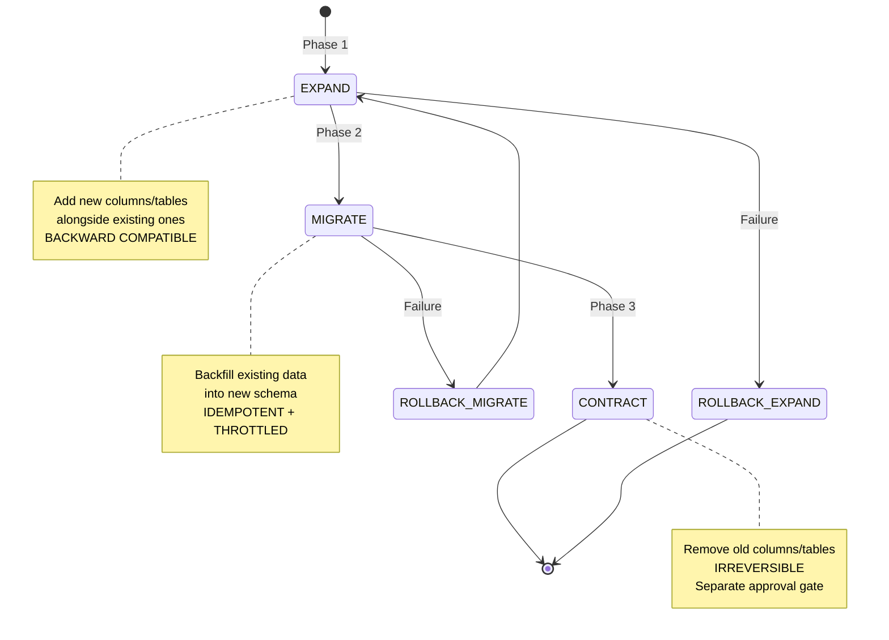

# Deliverable 4: Zero-Downtime Database Migration Strategy — NovaPay Digital Bank

> **AI Attribution Block**: This document was developed with AI-assisted research and drafting. All architectural decisions and technical specifications were reviewed, validated, and refined by Nihal N. AI tools used: GitHub Copilot, ChatGPT (research assistance).

## 1. Executive Summary

This document defines NovaPay's zero-downtime database migration strategy using the **expand-contract pattern** for PostgreSQL 16. The strategy enables schema changes on tables containing 100+ million rows of financial data without maintenance windows, table locks, or service interruption. Every migration phase is independently deployable, reversible (except the contract phase), and auditable.

## 2. Expand-Contract Pattern

### 2.1 Three-Phase Migration Model



### 2.2 Phase Details

#### Phase 1: EXPAND (Backward Compatible)

- Add new columns, tables, or indexes alongside existing ones
- Both App V(N-1) and App V(N) can operate against this schema
- **Reversible**: Drop newly added columns/tables to rollback
- Uses `ALTER TABLE ... ADD COLUMN` (no table lock in PostgreSQL for nullable columns)
- Indexes created with `CREATE INDEX CONCURRENTLY` (no read/write locks)

```sql
-- EXPAND PHASE: Add encrypted_email column alongside existing email
-- Migration: V2.0__expand_add_encrypted_email.sql

ALTER TABLE customer_profiles
  ADD COLUMN encrypted_email BYTEA;

-- Create index concurrently (no locks)
CREATE INDEX CONCURRENTLY idx_customer_encrypted_email
  ON customer_profiles (encrypted_email);

-- Audit entry for RBI compliance
INSERT INTO schema_audit_log (migration_id, description, executed_by, phase, timestamp)
VALUES ('V2.0', 'Add encrypted_email column', current_user, 'EXPAND', NOW());
```

#### Phase 2: MIGRATE (Data Backfill)

- Backfill existing data into new schema using batch processing
- **Idempotent**: Can be safely retried without side effects
- **Throttled**: Pauses between batches to prevent production impact
- Monitors query latency during migration — aborts if impact > 20%

```sql
-- MIGRATE PHASE: Backfill encrypted_email from existing email column
-- Migration: V2.1__migrate_backfill_encrypted_email.sql

DO $$
DECLARE
    batch_size INT := 1000;
    total_migrated INT := 0;
    batch_count INT;
    start_latency FLOAT;
    current_latency FLOAT;
BEGIN
    -- Record baseline latency
    SELECT avg(total_exec_time / calls)
    INTO start_latency
    FROM pg_stat_statements
    WHERE query LIKE '%customer_profiles%';

    LOOP
        UPDATE customer_profiles
        SET encrypted_email = pgp_sym_encrypt(
            email,
            current_setting('app.encryption_key')
        )
        WHERE encrypted_email IS NULL
          AND id IN (
            SELECT id FROM customer_profiles
            WHERE encrypted_email IS NULL
            LIMIT batch_size
            FOR UPDATE SKIP LOCKED
        );

        GET DIAGNOSTICS batch_count = ROW_COUNT;
        total_migrated := total_migrated + batch_count;

        RAISE NOTICE 'Migrated % rows (total: %)', batch_count, total_migrated;

        EXIT WHEN batch_count = 0;

        -- Throttle: 100ms pause between batches
        PERFORM pg_sleep(0.1);

        -- Safety check: abort if latency impact > 20%
        SELECT avg(total_exec_time / calls)
        INTO current_latency
        FROM pg_stat_statements
        WHERE query LIKE '%customer_profiles%';

        IF current_latency > start_latency * 1.2 THEN
            RAISE WARNING 'Migration paused: query latency increased by > 20%%';
            PERFORM pg_sleep(5);  -- Wait 5 seconds before continuing
        END IF;
    END LOOP;
END $$;

-- Verify migration completeness
DO $$
BEGIN
    IF EXISTS (
        SELECT 1 FROM customer_profiles
        WHERE encrypted_email IS NULL AND email IS NOT NULL
    ) THEN
        RAISE EXCEPTION 'Migration incomplete: rows with email but no encrypted_email';
    END IF;
END $$;
```

#### Phase 3: CONTRACT (Irreversible)

- Remove old columns/tables after ALL services have migrated
- **This step is forward-only** — it cannot be rolled back
- Must be a **separate deployment** with its own approval gate
- Requires DBA approval + Head of Compliance sign-off

```sql
-- CONTRACT PHASE: Remove old email column
-- Migration: V2.2__contract_remove_plain_email.sql
-- WARNING: IRREVERSIBLE - Requires DBA + Compliance approval

-- Verify all services are using encrypted_email
DO $$
BEGIN
    -- Check application version compatibility
    IF EXISTS (
        SELECT 1 FROM pg_stat_activity
        WHERE application_name LIKE 'novapay%'
          AND application_name NOT LIKE '%v2.14%'
    ) THEN
        RAISE EXCEPTION 'Old application versions still connected. Cannot contract.';
    END IF;
END $$;

-- Drop old column
ALTER TABLE customer_profiles DROP COLUMN email;

-- Drop old index (if exists)
DROP INDEX IF EXISTS idx_customer_email;

-- Audit entry
INSERT INTO schema_audit_log (migration_id, description, executed_by, phase, timestamp)
VALUES ('V2.2', 'Remove plain email column (contracted)', current_user, 'CONTRACT', NOW());
```

## 3. Version Compatibility Matrix

| Schema State | App V2.13 (N-1) | App V2.14 (N) | Notes |
|-------------|-----------------|---------------|-------|
| **Before Expand** | ✅ Uses `email` column | ❌ Cannot start (missing `encrypted_email`) | Normal pre-migration state |
| **After Expand** | ✅ Uses `email` column, ignores `encrypted_email` | ✅ Uses `encrypted_email`, falls back to `email` | Both versions work — deploy window |
| **After Migrate** | ✅ `email` still available | ✅ `encrypted_email` fully populated | Ready for contract |
| **After Contract** | ❌ Fails (missing `email` column) | ✅ Uses `encrypted_email` only | All services must be V2.14+ |

**Critical rule**: Contract phase MUST NOT execute until all running instances are V2.14+.

## 4. Migration Governance Framework

### 4.1 Approval Gates

| Phase | Approver | Automated Check | Manual Gate |
|-------|----------|----------------|-------------|
| Expand | DBA (automated review) | Schema compatibility check | None (auto-approved if checks pass) |
| Migrate | DBA + SRE Lead | Latency impact monitoring | Pause if latency > 20% |
| Contract | DBA + Head of Compliance | Version compatibility check | Mandatory manual approval |

### 4.2 DBA Review Checklist

- [ ] Migration is backward compatible (expand) or all services updated (contract)
- [ ] No table-level locks introduced
- [ ] Indexes created with `CONCURRENTLY` keyword
- [ ] Batch size appropriate for table size (≤ 1000 for 100M+ row tables)
- [ ] Throttling mechanism included (pg_sleep between batches)
- [ ] Latency abort threshold configured (20%)
- [ ] Rollback procedure documented for this specific migration
- [ ] Audit log entries included
- [ ] Tested in pre-production with production-scale data

## 5. Online Schema Migration Tools

### Tool Selection: pgroll (PostgreSQL)

| Feature | pgroll | gh-ost | pt-online-schema-change |
|---------|--------|--------|------------------------|
| Database | PostgreSQL | MySQL | MySQL |
| Lock-free | ✅ | ✅ | ✅ |
| Trigger-based | ❌ (CDC) | ✅ | ✅ |
| Backfill | ✅ | ✅ | ✅ |
| Abort support | ✅ | ✅ | ✅ |
| **Selected for NovaPay** | ✅ | N/A | N/A |

### pgroll Configuration

```yaml
# pgroll.yaml
migrations:
  - name: "add_encrypted_email"
    operations:
      - alter_column:
          table: customer_profiles
          column: email
          up: "pgp_sym_encrypt(email, current_setting('app.encryption_key'))"
          down: "pgp_sym_decrypt(encrypted_email, current_setting('app.encryption_key'))"
    
    settings:
      batch_size: 1000
      throttle_ms: 100
      abort_on_latency_increase: 20%
      max_runtime: "4h"
```

## 6. Data Backfill Strategy for 100M+ Row Tables

### Batch Sizing

| Table Size | Batch Size | Throttle | Estimated Duration |
|-----------|-----------|---------|-------------------|
| < 1M rows | 10,000 | 50ms | < 10 minutes |
| 1M–10M rows | 5,000 | 100ms | 30–60 minutes |
| 10M–100M rows | 1,000 | 100ms | 2–4 hours |
| > 100M rows | 500 | 200ms | 4–8 hours |

### Monitoring During Migration

```yaml
alerts:
  - name: migration_latency_impact
    condition: "avg(query_latency_ms) > baseline * 1.2"
    action: "Pause migration, alert DBA"
  
  - name: migration_replication_lag
    condition: "replication_lag_bytes > 100MB"
    action: "Pause migration, wait for replica catch-up"
  
  - name: migration_lock_wait
    condition: "lock_wait_time > 5s"
    action: "Abort current batch, retry after 30s"
```

## 7. Rollback Procedures

| Phase | Rollback Method | Risk Level | Duration |
|-------|----------------|------------|----------|
| Expand | `ALTER TABLE DROP COLUMN` (new columns) | Low | < 1 minute |
| Migrate | Re-run migration (idempotent) | Low | Depends on data volume |
| Contract | ❌ **IRREVERSIBLE** — restore from backup if needed | Critical | 30–60 minutes (backup restore) |

### Expand Phase Rollback

```sql
-- Rollback expand: remove newly added column
ALTER TABLE customer_profiles DROP COLUMN IF EXISTS encrypted_email;
DROP INDEX IF EXISTS idx_customer_encrypted_email;

INSERT INTO schema_audit_log (migration_id, description, executed_by, phase, timestamp)
VALUES ('V2.0-rollback', 'Rolled back encrypted_email column', current_user, 'ROLLBACK', NOW());
```

## 8. Cross-References

- **Pipeline architecture**: See [Deliverable 1](../01-pipeline-architecture/architecture.md)
- **Deployment strategies**: See [Deliverable 2](../02-deployment-strategies/deployment-strategies.md) — schema changes require canary deployment
- **Environment promotion**: See [Deliverable 5](../05-environment-promotion/environment-promotion.md) — migrations tested in pre-prod with production-scale data
- **Rollback specification**: See [Deliverable 6](../06-rollback-specification/rollback-specification.md) — database-aware rollback procedures
