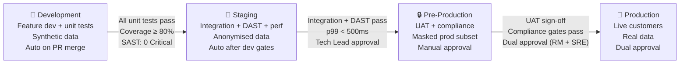

# Deliverable 5: Environment Promotion Workflow — NovaPay Digital Bank

> **AI Attribution Block**: This document was developed with AI-assisted research and drafting. All architectural decisions and technical specifications were reviewed, validated, and refined by Nihal N. AI tools used: GitHub Copilot, ChatGPT (research assistance).

## 1. Executive Summary

NovaPay uses a four-environment promotion model (Development → Staging → Pre-Production → Production) standard in regulated banking. This document defines the purpose, data profile, access control, deployment trigger, and promotion criteria for each environment, along with secrets management, feature flag strategy, and configuration drift detection.

## 2. Four-Environment Model



## 3. Environment Specifications

### 3.1 Development

| Attribute | Value |
|-----------|-------|
| **Purpose** | Feature development, unit testing, developer experimentation |
| **Data Profile** | Synthetic/mock data only — no customer data |
| **Access Control** | All developers (read/write) |
| **Deploy Trigger** | Automatic on PR merge to `main` |
| **Infrastructure** | Minimal (1 replica per service, shared namespace) |
| **Namespace** | `novapay-dev` |

### 3.2 Staging

| Attribute | Value |
|-----------|-------|
| **Purpose** | Integration testing, DAST scanning, performance baseline |
| **Data Profile** | Anonymised production-like data (no real PII) |
| **Access Control** | Dev team + QA team |
| **Deploy Trigger** | Automatic after all dev gates pass |
| **Infrastructure** | Production-like (2 replicas, separate databases) |
| **Namespace** | `novapay-staging` |

### 3.3 Pre-Production

| Attribute | Value |
|-----------|-------|
| **Purpose** | UAT, compliance verification, regulatory readiness |
| **Data Profile** | Masked production data subset (PII redacted) |
| **Access Control** | QA + Compliance + DBA |
| **Deploy Trigger** | Manual approval after staging gates pass |
| **Infrastructure** | Production-mirror (same replica count, same resource limits) |
| **Namespace** | `novapay-preprod` |

### 3.4 Production

| Attribute | Value |
|-----------|-------|
| **Purpose** | Live customer-facing environment |
| **Data Profile** | Real production data |
| **Access Control** | SRE + Release Manager only (deploy access) |
| **Deploy Trigger** | Dual approval (Release Manager AND SRE Lead) |
| **Infrastructure** | Full scale (6+ replicas, multi-AZ, auto-scaling) |
| **Namespace** | `novapay-prod` |

## 4. Promotion Criteria

### 4.1 Development → Staging

```yaml
promotion_criteria:
  automated: true  # No human approval required
  gates:
    - name: "Unit Tests"
      threshold: "100% pass rate (0 failures tolerated)"
    - name: "Code Coverage"
      threshold: "≥ 80% line coverage, ≥ 70% branch coverage"
    - name: "SAST Scan"
      threshold: "0 Critical vulnerabilities, ≤ 2 High findings"
    - name: "Build Artefact"
      threshold: "Signed and pushed to Artifactory with SemVer tag"
    - name: "Dependency Lock"
      threshold: "Lock file in sync"
```

### 4.2 Staging → Pre-Production

```yaml
promotion_criteria:
  automated: false  # Tech Lead approval required
  gates:
    - name: "Integration Tests"
      threshold: "100% pass including consumer-driven contract tests"
    - name: "DAST Scan"
      threshold: "0 Critical/High findings from OWASP Top 10"
    - name: "Performance Test"
      threshold: "p99 latency < 500ms under 2x expected production load"
    - name: "Dependency Scan"
      threshold: "0 Critical CVEs, SBOM generated and archived"
    - name: "Licence Compliance"
      threshold: "No GPL/AGPL dependencies detected"
  approvers:
    - role: "Tech Lead"
      method: "GitHub PR review approval"
```

### 4.3 Pre-Production → Production

```yaml
promotion_criteria:
  automated: false  # Dual approval required
  gates:
    - name: "UAT Sign-off"
      threshold: "Formal written approval from Product Owner"
    - name: "Regulatory Compliance"
      threshold: "All RBI + PCI-DSS mapping gates passed"
    - name: "Database Migration"
      threshold: "Tested and validated in pre-prod with production-scale data"
    - name: "Deployment Runbook"
      threshold: "Reviewed, updated, and signed off by SRE Lead"
    - name: "CAB Approval"
      threshold: "Change Advisory Board approval OR pre-approved change category"
    - name: "Deployment Window"
      threshold: "Not in blackout period, not during peak hours"
    - name: "On-call Confirmation"
      threshold: "On-call engineer confirmed available and briefed"
  approvers:
    - role: "Release Manager"
      method: "GitHub deployment review"
    - role: "SRE Lead"
      method: "GitHub deployment review"
  segregation_of_duties:
    rule: "Deployer ≠ Code author ≠ Code reviewer"
```

## 5. Configuration Management Strategy

### 5.1 Same Artefact, Different Config

The **same container image** is promoted through all four environments. Only the configuration changes.

```
values.yaml (base)
├── values-dev.yaml (dev overrides)
├── values-staging.yaml (staging overrides)
├── values-preprod.yaml (pre-prod overrides)
└── values-production.yaml (production overrides)
```

### 5.2 Configuration Hierarchy

```yaml
# values.yaml (base - shared across all environments)
replicaCount: 1
image:
  repository: artifactory.novapay.internal/docker-local/novapay-app
  pullPolicy: IfNotPresent
resources:
  requests:
    cpu: 250m
    memory: 512Mi
  limits:
    cpu: 1000m
    memory: 1Gi

# values-production.yaml (production overrides)
replicaCount: 6
resources:
  requests:
    cpu: 1000m
    memory: 2Gi
  limits:
    cpu: 2000m
    memory: 4Gi
autoscaling:
  enabled: true
  minReplicas: 6
  maxReplicas: 20
  targetCPUUtilizationPercentage: 70
  targetMemoryUtilizationPercentage: 80
```

### 5.3 Secrets Management — HashiCorp Vault

```yaml
secrets_management:
  provider: "HashiCorp Vault"
  injection: "Vault Agent Sidecar Injector"
  rotation_policy:
    database_passwords: "90 days"
    api_keys: "30 days"
    tls_certificates: "365 days (auto-renewal at 30 days before expiry)"
  rules:
    - "No plaintext secrets in Git"
    - "No secrets in Helm values files"
    - "No secrets in Kubernetes manifests"
    - "No secrets in environment variables (use volume mounts)"
```

```yaml
# Vault injection annotation in Pod spec
metadata:
  annotations:
    vault.hashicorp.com/agent-inject: "true"
    vault.hashicorp.com/role: "novapay-app"
    vault.hashicorp.com/agent-inject-secret-db-creds: "secret/data/novapay/production/database"
    vault.hashicorp.com/agent-inject-template-db-creds: |
      {{- with secret "secret/data/novapay/production/database" -}}
      spring.datasource.username={{ .Data.data.username }}
      spring.datasource.password={{ .Data.data.password }}
      {{- end }}
```

### 5.4 Feature Flags

```yaml
feature_flags:
  provider: "Environment-aware toggle system (Unleash / custom)"
  strategy: "Gradual rollout via percentage"
  rollout_pattern:
    - "1% → 10% → 50% → 100%"
  environments:
    development: "All features enabled"
    staging: "All features enabled"
    pre_production: "Feature flags mirror production"
    production: "Gradual rollout via percentage"
  governance:
    - "Feature flags expire after 90 days (must be fully enabled or removed)"
    - "Stale feature flag report generated weekly"
    - "Each flag has an owner (team + individual)"
```

### 5.5 Configuration Drift Detection — ArgoCD

```yaml
drift_detection:
  tool: "ArgoCD built-in sync status"
  frequency: "Every 3 minutes"
  on_drift:
    notification: "Slack #novapay-ops + PagerDuty"
    auto_sync: true  # Auto-correct drift to Git state
    audit_log: true   # Log drift events for compliance
  policy: "Git is the single source of truth"
```

### 5.6 No Environment-Specific Branches

```
RULE: The same `main` branch produces the same container image for ALL environments.
      Environment differences are ONLY in configuration, NEVER in code.
      
VIOLATION: Creating `staging-branch` or `prod-branch` is PROHIBITED.
```

## 6. Data Management Per Environment

| Environment | Data Source | PII Handling | Refresh Frequency |
|------------|-----------|-------------|-------------------|
| Development | Synthetic generator | No real PII ever | On-demand |
| Staging | Production snapshot | Anonymised (names, emails, phones replaced) | Weekly |
| Pre-Production | Production subset | Masked (Aadhaar: XXXX-XXXX-1234, PAN: XXXXX1234X) | Before each UAT cycle |
| Production | Live data | Full PII (protected by access controls) | N/A |

## 7. Cross-References

- **Pipeline architecture**: See [Deliverable 1](../01-pipeline-architecture/architecture.md)
- **Compliance gates per promotion**: See [Deliverable 3](../03-compliance-gates/compliance-gates.md)
- **Database migration across environments**: See [Deliverable 4](../04-database-migration/database-migration.md)
- **Rollback per environment**: See [Deliverable 6](../06-rollback-specification/rollback-specification.md)
