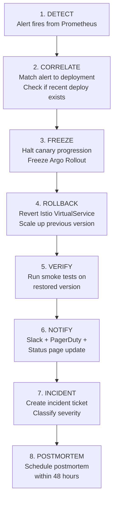

# Deliverable 6: Rollback Specification — NovaPay Digital Bank

> **AI Attribution Block**: This document was developed with AI-assisted research and drafting. All architectural decisions and technical specifications were reviewed, validated, and refined by Nihal N. AI tools used: GitHub Copilot, ChatGPT (research assistance).

## 1. Executive Summary

Automated rollback is the safety net that makes rapid deployment possible at NovaPay. This document defines three categories of rollback triggers, the 8-step rollback execution workflow, post-rollback verification procedures, and Prometheus alerting rules. The system guarantees sub-60-second rollback for Category A triggers with zero human intervention.

## 2. Rollback Trigger Taxonomy

### Category A — Immediate (< 60 seconds)

These triggers initiate **instant traffic re-routing** with zero human intervention.

| # | Trigger | Detection Method | Threshold | Auto-Action |
|---|---------|-----------------|-----------|-------------|
| 1 | HTTP 5xx error rate spike | Prometheus `http_server_requests_seconds_count{status=~"5.."}` | > 5% for 60 seconds | Instant rollback |
| 2 | Health check failure | Kubernetes liveness probe | 3 consecutive failures | Pod restart → rollback if persists |
| 3 | OOM kills | Kubernetes event `OOMKilled` | Any OOM event in canary pods | Instant rollback |
| 4 | CrashLoopBackOff | Kubernetes pod status | Pod enters CrashLoopBackOff | Instant rollback |
| 5 | Database connection pool exhaustion | HikariCP metrics `hikaricp_connections_active` | Active connections = max pool size for 30s | Instant rollback |

### Prometheus Alerting Rules — Category A

```yaml
groups:
  - name: novapay-rollback-category-a
    rules:
      - alert: HighErrorRate
        expr: |
          sum(rate(http_server_requests_seconds_count{
            service="novapay-app",
            status=~"5.."
          }[1m])) /
          sum(rate(http_server_requests_seconds_count{
            service="novapay-app"
          }[1m])) > 0.05
        for: 60s
        labels:
          severity: critical
          rollback_category: A
          auto_rollback: "true"
        annotations:
          summary: "NovaPay HTTP 5xx rate exceeds 5%"
          runbook: "https://runbooks.novapay.internal/rollback-5xx"

      - alert: HealthCheckFailure
        expr: |
          kube_pod_container_status_ready{
            namespace="novapay-prod",
            container="novapay-app"
          } == 0
        for: 90s
        labels:
          severity: critical
          rollback_category: A
          auto_rollback: "true"
        annotations:
          summary: "NovaPay pod health check failing"

      - alert: OOMKilled
        expr: |
          kube_pod_container_status_last_terminated_reason{
            namespace="novapay-prod",
            reason="OOMKilled"
          } == 1
        labels:
          severity: critical
          rollback_category: A
          auto_rollback: "true"
        annotations:
          summary: "NovaPay container OOMKilled"

      - alert: CrashLoopBackOff
        expr: |
          kube_pod_container_status_waiting_reason{
            namespace="novapay-prod",
            reason="CrashLoopBackOff"
          } == 1
        labels:
          severity: critical
          rollback_category: A
          auto_rollback: "true"
        annotations:
          summary: "NovaPay pod in CrashLoopBackOff"

      - alert: DBConnectionPoolExhaustion
        expr: |
          hikaricp_connections_active{
            service="novapay-app"
          } >= hikaricp_connections_max{
            service="novapay-app"
          }
        for: 30s
        labels:
          severity: critical
          rollback_category: A
          auto_rollback: "true"
        annotations:
          summary: "Database connection pool exhausted"
```

### Category B — Escalated (< 15 minutes)

These triggers alert on-call engineer; **auto-rollback if no human response** within the escalation window.

| # | Trigger | Detection Method | Threshold | Escalation |
|---|---------|-----------------|-----------|------------|
| 1 | Latency p99 degradation | Prometheus histogram | > 2x baseline for 5 min | Alert on-call; auto-rollback if no response in 10 min |
| 2 | Error budget burn rate | SLO monitoring (Sloth) | > 10x normal burn rate for 10 min | Alert on-call + VP Eng |
| 3 | Transaction success rate drop | Custom metric | > 2% below baseline | Alert on-call + SRE Lead |
| 4 | Resource saturation | Prometheus node metrics | CPU > 90% or memory > 85% sustained 5 min | Alert on-call; auto-rollback if no response in 10 min |

### Prometheus Alerting Rules — Category B

```yaml
      - alert: LatencyDegradation
        expr: |
          histogram_quantile(0.99,
            sum(rate(http_server_requests_seconds_bucket{
              service="novapay-app"
            }[5m])) by (le)
          ) > 2 * (
            histogram_quantile(0.99,
              sum(rate(http_server_requests_seconds_bucket{
                service="novapay-app"
              }[1h] offset 1d)) by (le)
            )
          )
        for: 5m
        labels:
          severity: warning
          rollback_category: B
          auto_rollback: "true"
          escalation_window: "10m"
        annotations:
          summary: "NovaPay p99 latency > 2x baseline"

      - alert: ErrorBudgetBurnRate
        expr: |
          slo:burn_rate:5m{service="novapay-app"} > 10
        for: 10m
        labels:
          severity: warning
          rollback_category: B
        annotations:
          summary: "Error budget burning 10x faster than normal"

      - alert: TransactionSuccessRateDrop
        expr: |
          (1 - (
            sum(rate(payment_transactions_total{
              status="success", service="novapay-app"
            }[5m])) /
            sum(rate(payment_transactions_total{
              service="novapay-app"
            }[5m]))
          )) > (
            avg_over_time(
              (1 - sum(rate(payment_transactions_total{
                status="success", service="novapay-app"
              }[5m])) /
              sum(rate(payment_transactions_total{
                service="novapay-app"
              }[5m]))
              )[7d:]
            ) + 0.02
          )
        for: 5m
        labels:
          severity: warning
          rollback_category: B
        annotations:
          summary: "Transaction success rate dropped > 2% below baseline"
```

### Category C — Manual Decision

These triggers surface warnings requiring **human judgment**. No automated rollback.

| # | Trigger | Detection | Action |
|---|---------|-----------|--------|
| 1 | Gradual degradation below thresholds | Trend analysis (Grafana ML) | Surface warning; SRE evaluates |
| 2 | Customer support ticket spike | Zendesk/helpline integration | Correlate with deployment; SRE evaluates |
| 3 | Retroactive compliance failure | Post-deployment compliance scan | Notify Compliance team; may require rollback |
| 4 | Downstream dependency correlation | Cross-service metric correlation | Investigate root cause before deciding |

## 3. Eight-Step Rollback Execution Workflow



### Step Details

| Step | Action | Owner | Duration | Output |
|------|--------|-------|----------|--------|
| 1. DETECT | Prometheus alert fires, Alertmanager routes to appropriate channel | Automated | < 30 seconds | Alert notification |
| 2. CORRELATE | Check if alert correlates with recent deployment (< 2 hours ago) | Automated | < 10 seconds | Deployment correlation result |
| 3. FREEZE | Halt Argo Rollout canary progression; prevent further traffic shifts | Automated | < 5 seconds | Rollout frozen |
| 4. ROLLBACK | Update Istio VirtualService to route 100% traffic to previous stable version | Automated (Cat A) / On-call (Cat B) | < 30 seconds | Traffic restored |
| 5. VERIFY | Run smoke test suite against restored version; compare metrics to pre-deployment baseline | Automated | < 3 minutes | Verification report |
| 6. NOTIFY | Send notifications: Slack (#novapay-incidents), PagerDuty, status page, stakeholder email | Automated | < 1 minute | Notifications sent |
| 7. INCIDENT | Create incident ticket in Jira with severity classification, affected services, timeline | Automated | < 1 minute | Incident ticket created |
| 8. POSTMORTEM | Schedule blameless postmortem within 48 hours; assign postmortem lead | On-call engineer | Next business day | Postmortem scheduled |

### Rollback Execution — ArgoCD + Istio

```bash
#!/bin/bash
# rollback.sh — Automated rollback script

# Step 3: Freeze current rollout
kubectl argo rollouts abort novapay-app -n novapay-prod

# Step 4: Revert to previous revision
kubectl argo rollouts undo novapay-app -n novapay-prod

# Wait for pods to be ready
kubectl rollout status deployment/novapay-app-stable -n novapay-prod --timeout=120s

# Step 5: Run smoke tests
./scripts/smoke-test.sh --env production --timeout 60

# Step 6: Notify
curl -X POST "${SLACK_WEBHOOK}" \
  -H 'Content-type: application/json' \
  --data "{
    \"channel\": \"#novapay-incidents\",
    \"text\": \"🔄 ROLLBACK EXECUTED: novapay-app reverted to previous version. Trigger: ${ALERT_NAME}. Status: $([ $? -eq 0 ] && echo 'SUCCESS' || echo 'NEEDS ATTENTION')\"
  }"
```

## 4. Post-Rollback Verification

| Check | Method | Expected Outcome |
|-------|--------|-----------------|
| Smoke tests | Automated smoke test suite | 100% pass rate |
| Error rate | Compare to pre-deployment baseline | Within 0.1% of baseline |
| Latency p99 | Compare to pre-deployment baseline | Within 10% of baseline |
| Pod health | Kubernetes readiness probes | All pods Ready |
| Database connectivity | Connection pool metrics | Active connections < 80% of max |
| Customer impact | Synthetic transactions | 100% success rate |

## 5. Cross-References

- **Pipeline architecture**: See [Deliverable 1](../01-pipeline-architecture/architecture.md) — rollback triggers integrated into Stage 8
- **Deployment strategies**: See [Deliverable 2](../02-deployment-strategies/deployment-strategies.md) — canary rollback vs blue-green rollback
- **Observability metrics**: See [Deliverable 8](../08-observability/observability.md) — metrics powering rollback decisions
- **Incident playbook**: See [Deliverable 7](../07-runbook-playbook/ops-documentation.md) — post-rollback incident procedures
