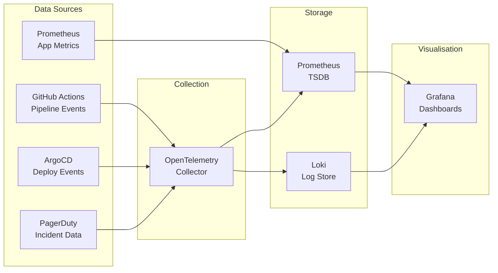
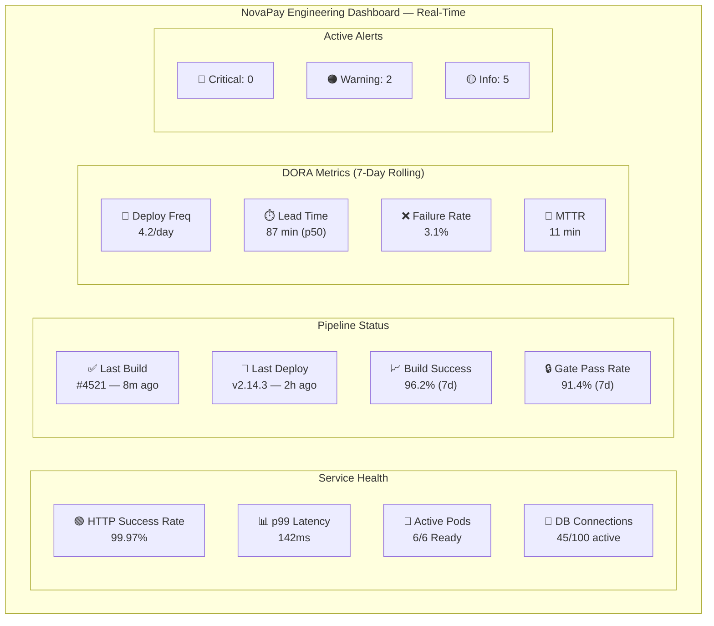
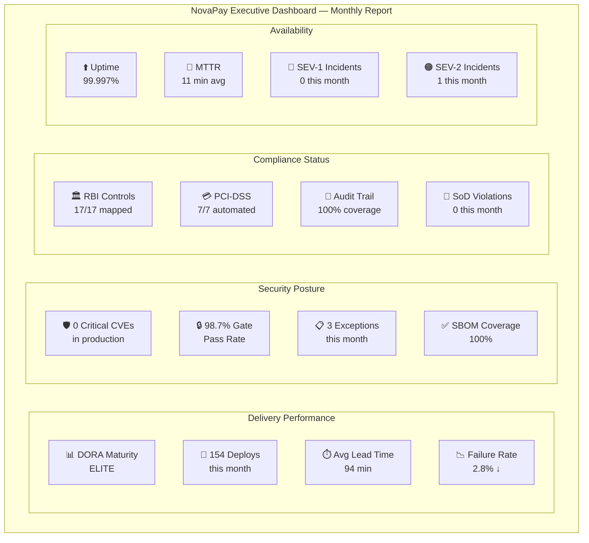
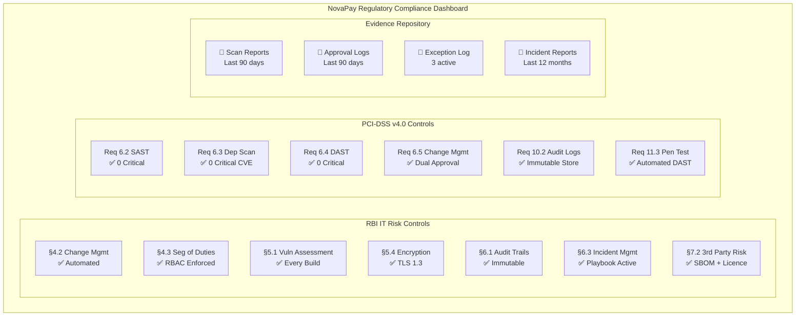

# Deliverable 8: Observability & DORA Metrics — NovaPay Digital Bank

> **AI Attribution Block**: This document was developed with AI-assisted research and drafting. All specifications reviewed, validated, and refined by Nihal N. AI tools used: GitHub Copilot, ChatGPT (research assistance).

## 1. Executive Summary

This document defines NovaPay's observability strategy covering DORA metrics implementation, 15+ pipeline-specific metrics, three dashboard designs (Engineering, Management, Regulatory), and an alerting strategy with severity-based routing. The observability stack uses Prometheus (metrics), Grafana (visualisation), OpenTelemetry (tracing), and Loki (logs).

## 2. DORA Metrics Implementation

| DORA Metric | Definition | Elite Target | NovaPay Target | Measurement Method |
|------------|-----------|-------------|---------------|-------------------|
| Deployment Frequency | How often code deploys to production | Multiple per day | ≥ 3 per day | Count of production deployments per day |
| Lead Time for Changes | Commit to production deployment time | < 1 hour | < 2 hours | Timestamp diff: `git commit timestamp` → `prod deploy timestamp` |
| Change Failure Rate | % of deployments causing failures | < 5% | < 5% | `(rollbacks + hotfixes) / total deployments × 100` |
| Mean Time to Recovery | Time to restore after failure | < 1 hour | < 15 minutes | Incident duration: `detection timestamp` → `resolution timestamp` |

### Measurement Architecture



### DORA Metric Queries (Prometheus)

```yaml
# Deployment Frequency
- record: dora:deployment_frequency:daily
  expr: |
    count(
      argocd_app_sync_total{
        project="novapay",
        dest_namespace="novapay-prod",
        phase="Succeeded"
      }
    ) by (day)

# Lead Time for Changes (requires custom metric from CI)
- record: dora:lead_time:p50
  expr: |
    histogram_quantile(0.50,
      sum(rate(cicd_lead_time_seconds_bucket{
        environment="production"
      }[24h])) by (le)
    )

# Change Failure Rate
- record: dora:change_failure_rate
  expr: |
    sum(increase(deployment_rollbacks_total{
      environment="production"
    }[7d])) /
    sum(increase(deployments_total{
      environment="production"
    }[7d])) * 100

# MTTR
- record: dora:mttr:avg
  expr: |
    avg(incident_resolution_duration_seconds{
      severity=~"SEV-1|SEV-2"
    })
```

## 3. Pipeline-Specific Metrics (15+)

### Build Metrics

| # | Metric | PromQL | Target |
|---|--------|--------|--------|
| 1 | Build success rate | `sum(cicd_build_total{status="success"}) / sum(cicd_build_total) * 100` | > 95% |
| 2 | Build duration (p95) | `histogram_quantile(0.95, sum(rate(cicd_build_duration_seconds_bucket[24h])) by (le))` | < 12 min |
| 3 | Flaky test rate | `sum(cicd_test_flaky_total) / sum(cicd_test_total) * 100` | < 2% |
| 4 | Cache hit rate | `sum(cicd_cache_hits_total) / sum(cicd_cache_requests_total) * 100` | > 80% |

### Compliance Metrics

| # | Metric | PromQL | Target |
|---|--------|--------|--------|
| 5 | SAST gate pass rate | `sum(compliance_gate_total{gate="sast", result="pass"}) / sum(compliance_gate_total{gate="sast"}) * 100` | > 90% |
| 6 | DAST gate pass rate | `sum(compliance_gate_total{gate="dast", result="pass"}) / sum(compliance_gate_total{gate="dast"}) * 100` | > 85% |
| 7 | CVE detection rate | `sum(increase(vulnerability_detected_total[7d])) by (severity)` | Trending down |
| 8 | False positive rate | `sum(compliance_false_positive_total) / sum(compliance_finding_total) * 100` | < 5% |
| 9 | Exception count | `sum(increase(compliance_exception_total[30d]))` | < 5/month |

### Deployment Metrics

| # | Metric | PromQL | Target |
|---|--------|--------|--------|
| 10 | Deployment duration | `histogram_quantile(0.95, sum(rate(deployment_duration_seconds_bucket[7d])) by (le))` | < 30 min |
| 11 | Rollback frequency | `sum(increase(deployment_rollbacks_total[7d]))` | < 1/week |
| 12 | Rollback trigger distribution | `sum(increase(deployment_rollbacks_total[30d])) by (category)` | Mostly Cat B/C |
| 13 | Canary promotion rate | `sum(canary_promoted_total) / sum(canary_started_total) * 100` | > 95% |
| 14 | Pod startup time | `histogram_quantile(0.95, sum(rate(pod_startup_duration_seconds_bucket[7d])) by (le))` | < 30s |
| 15 | Deployment window compliance | `sum(deployments_in_window_total) / sum(deployments_total) * 100` | 100% |
| 16 | SLO compliance | `sum(slo_compliance_total{met="true"}) / sum(slo_compliance_total) * 100` | > 99.9% |

## 4. Dashboard Designs

### 4.1 Engineering Dashboard (Real-Time Operations)



**Panels**: HTTP success rate (time series), p99 latency (time series with baseline), pod status (table), DB connection pool (gauge), pipeline run history (table), DORA metric trends (stat + sparkline), active alerts (list).

### 4.2 Management Dashboard (Weekly/Monthly Executive)



**Panels**: DORA score card (stat panels), deployment trend (bar chart, monthly), security findings trend (stacked area), compliance gate health (heatmap), availability SLO (gauge), incident trend (table).

### 4.3 Regulatory Dashboard (Audit-Ready Compliance)



**Panels**: Regulatory control status (traffic light matrix), compliance gate trend (time series per gate), exception tracker (table with expiry dates), audit evidence links (table with download links), scan coverage percentage (gauge per tool), segregation of duties audit log (table).

## 5. Alerting Strategy

### Severity-Based Routing

```yaml
# alertmanager.yml
route:
  receiver: default-slack
  group_by: ['alertname', 'service']
  group_wait: 30s
  group_interval: 5m
  repeat_interval: 4h
  routes:
    - match:
        severity: critical
        rollback_category: A
      receiver: pagerduty-critical
      group_wait: 0s
      repeat_interval: 5m
    
    - match:
        severity: critical
      receiver: pagerduty-critical
      group_wait: 10s
      repeat_interval: 15m
    
    - match:
        severity: warning
      receiver: slack-warning
      group_wait: 1m
      repeat_interval: 1h
    
    - match:
        severity: info
      receiver: slack-info
      repeat_interval: 24h

receivers:
  - name: pagerduty-critical
    pagerduty_configs:
      - routing_key: "${PAGERDUTY_ROUTING_KEY}"
        severity: critical
  
  - name: slack-warning
    slack_configs:
      - api_url: "${SLACK_WEBHOOK_URL}"
        channel: '#novapay-alerts'
        title: '{{ .GroupLabels.alertname }}'
        text: '{{ range .Alerts }}{{ .Annotations.summary }}{{ end }}'
  
  - name: slack-info
    slack_configs:
      - api_url: "${SLACK_WEBHOOK_URL}"
        channel: '#novapay-ops'
  
  - name: default-slack
    slack_configs:
      - api_url: "${SLACK_WEBHOOK_URL}"
        channel: '#novapay-ops'
```

### Escalation Matrix

| Severity | Initial | +15 min no ack | +30 min no ack | +60 min no ack |
|----------|---------|---------------|---------------|---------------|
| Critical (Cat A) | Auto-rollback + PagerDuty SRE | PagerDuty SRE Lead | Phone VP Eng | Phone CTO |
| Critical (Cat B) | PagerDuty SRE on-call | PagerDuty SRE Lead | Slack VP Eng | Phone VP Eng |
| Warning | Slack #novapay-alerts | PagerDuty SRE on-call | — | — |
| Info | Slack #novapay-ops | — | — | — |

## 6. Cross-References

- **Pipeline architecture**: See [Deliverable 1](../01-pipeline-architecture/architecture.md)
- **Rollback triggers (metrics-based)**: See [Deliverable 6](../06-rollback-specification/rollback-specification.md)
- **Incident response**: See [Incident Playbook](../../runbooks/incident-playbook.md)
- **Deployment monitoring**: See [Deliverable 2](../02-deployment-strategies/deployment-strategies.md)
