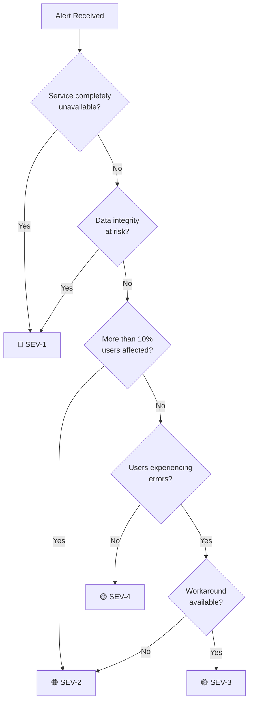
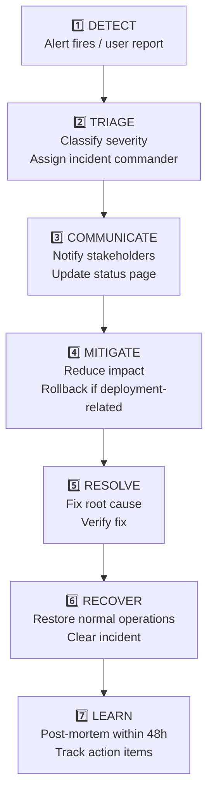
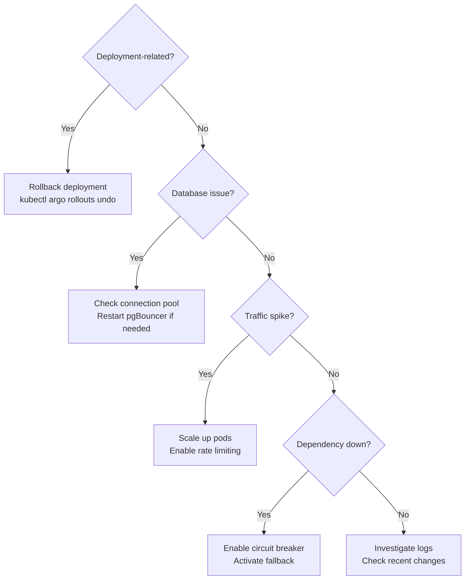

# NovaPay Digital Bank — Incident Response Playbook

> **AI Attribution Block**: Developed with AI-assisted research. All procedures reviewed and validated by Nihal N.

> **Document Classification**: INTERNAL — All Engineering Staff
> **Last Updated**: 2026-08-22 | **Owner**: SRE Team | **Review Cycle**: Quarterly

---

## 1. Severity Classification

| Severity | Definition | Response Time | Escalation Path | Communication |
|----------|-----------|--------------|-----------------|---------------|
| **SEV-1** | Complete service outage or data integrity risk | < 5 minutes | CTO + CISO + VP Eng | Every 30 min |
| **SEV-2** | Major feature degradation affecting > 10% users | < 15 minutes | VP Eng + SRE Lead | Every 60 min |
| **SEV-3** | Minor degradation, workaround exists | < 1 hour | SRE on-call + Tech Lead | Daily |
| **SEV-4** | Cosmetic issue, no user impact | Next business day | Assigned engineer | Jira ticket |

### Severity Decision Tree



---

## 2. Seven-Step Incident Response Workflow



### Step 1: DETECT

| Source | Detection Method | SLA |
|--------|-----------------|-----|
| Prometheus alerts | Automated alerting rules → PagerDuty | < 30 seconds |
| Synthetic monitoring | Grafana Synthetic checks → PagerDuty | < 1 minute |
| User reports | Customer support → Slack #novapay-incidents | < 5 minutes |
| RBI/NPCI notification | Regulatory channel → CTO direct | Immediate |

### Step 2: TRIAGE

**Incident Commander** (IC) is the on-call SRE engineer. IC responsibilities:
- Classify severity using decision tree
- Create incident channel: `#incident-YYYYMMDD-brief-description`
- Assign roles: IC, Communications Lead, Technical Lead
- Start incident timeline document

```bash
# Quick triage commands
# Check if recent deployment
kubectl argo rollouts list -n novapay-prod
git log --oneline -5 --format="%h %s (%cr)"

# Check pod status
kubectl get pods -n novapay-prod --sort-by='.status.startTime'

# Check error rate
curl -s "http://prometheus:9090/api/v1/query?query=rate(http_server_requests_seconds_count{status=~\"5..\"}[5m])" | jq '.data.result[0].value[1]'

# Check latest alerts
curl -s "http://alertmanager:9093/api/v2/alerts?silenced=false" | jq '.[].labels.alertname'
```

### Step 3: COMMUNICATE

**SEV-1 Communication Templates**:

#### Initial Acknowledgement (within 5 minutes)

```
🔴 INCIDENT DECLARED: SEV-1

Impact: [Brief description of user impact]
Affected Services: [Service names]
Incident Commander: [Name]
Status: Investigating

Current actions:
- [What is being done right now]

Next update: 30 minutes
Incident channel: #incident-YYYYMMDD-[description]
```

#### Regular Update (every 30 minutes for SEV-1)

```
🔴 SEV-1 UPDATE — [HH:MM IST]

Status: [Investigating / Mitigating / Resolved]
Duration: [Time since incident started]

Progress since last update:
- [Action taken 1]
- [Action taken 2]

Current hypothesis: [What we think is wrong]
Next steps: [What we're doing next]

ETA to resolution: [Estimate or "Unknown"]
Next update: 30 minutes
```

#### Resolution Notification

```
✅ INCIDENT RESOLVED — SEV-1

Service: NovaPay Digital Bank
Duration: [Start time] — [End time] ([Total duration])
Impact: [Number of users affected, transactions impacted]

Root Cause: [One-line summary]
Resolution: [What fixed it]

Post-mortem scheduled: [Date, Time]
Post-mortem lead: [Name]
```

#### External Status Page Update

```
[INVESTIGATING] We are investigating reports of [issue description].
Some users may experience [user-facing impact].
We are working to resolve this as quickly as possible.
```

#### RBI Regulatory Notification (for outages > 30 minutes)

```
Subject: Technology Incident Notification — NovaPay Digital Bank

Dear [RBI Contact],

This is to notify you of a technology incident affecting NovaPay Digital Bank's
digital banking services as per the RBI Master Direction on IT Risk Management.

Incident Start: [Timestamp IST]
Services Affected: [List]
Estimated Users Impacted: [Number]
Current Status: [Investigating / Mitigated / Resolved]
Expected Resolution: [ETA]

We will provide updates every [30 minutes / 1 hour].

[Authorized Signatory]
Head of Technology, NovaPay Digital Bank
```

### Step 4: MITIGATE



### Step 5: RESOLVE

- Fix root cause (code fix, config change, infrastructure fix)
- Deploy fix through standard pipeline (hotfix branch if needed)
- Verify fix in staging before production

### Step 6: RECOVER

- Confirm all metrics returned to baseline
- Close incident channel
- Update status page to "Operational"
- Send resolution notification

### Step 7: LEARN — Post-Mortem Template

```markdown
# Post-Mortem Report: [Incident Title]

**Date**: [Date]
**Duration**: [Start] — [End] ([Total])
**Severity**: [SEV-1/2/3]
**Lead**: [Name]
**Attendees**: [List]

## Timeline

| Time (IST) | Event |
|-----------|-------|
| HH:MM | [First alert fired] |
| HH:MM | [IC assigned, severity classified] |
| HH:MM | [Root cause identified] |
| HH:MM | [Mitigation applied] |
| HH:MM | [Service restored] |

## Root Cause

[Detailed explanation of what went wrong and why]

## Impact

- Users affected: [Number]
- Duration: [Minutes]
- Transactions impacted: [Number]
- Revenue impact: [Estimate if applicable]
- Regulatory implications: [RBI notification sent? SLA breached?]

## What Went Well

- [Thing 1]
- [Thing 2]

## What Went Wrong

- [Thing 1]
- [Thing 2]

## Action Items

| # | Action | Owner | Due Date | Status |
|---|--------|-------|----------|--------|
| 1 | [Action description] | [Name] | [Date] | Open |
| 2 | [Action description] | [Name] | [Date] | Open |

## Lessons Learned

[What should we change to prevent this class of incident?]
```

---

## 3. Incident Simulation Exercise Response

### Scenario: Friday 5:07 PM IST

Three simultaneous alerts:
1. **ALERT**: HTTP 500 error rate at 12% (threshold: 5%) — Severity: CRITICAL
2. **ALERT**: PostgreSQL connection pool exhaustion on primary — Severity: HIGH
3. **ALERT**: Downstream payment gateway timeout rate at 35% — Severity: CRITICAL

### Response Timeline

| Time | Action | Owner |
|------|--------|-------|
| T+0:00 (5:07 PM) | 🔴 Three alerts fire simultaneously. PagerDuty pages on-call SRE. | Automated |
| T+0:30 (5:07:30) | On-call SRE acknowledges page. Opens laptop. | SRE On-call |
| T+1:00 (5:08 PM) | **TRIAGE**: Classify as **SEV-1** (multiple critical alerts, service degradation). Create #incident-20260822-prod-errors. | IC (SRE On-call) |
| T+1:30 (5:08:30) | **CORRELATE**: Check recent deployments. `kubectl argo rollouts list -n novapay-prod` shows canary deployed at 4:59 PM (8 min ago). **Root cause hypothesis: canary deployment caused issue.** | IC |
| T+2:00 (5:09 PM) | **COMMUNICATE**: Post initial acknowledgement to #incident channel and #novapay-ops. Page VP Eng, SRE Lead, CTO. | IC |
| T+2:30 (5:09:30) | **FREEZE**: `kubectl argo rollouts abort novapay-app -n novapay-prod` — halt canary progression. | IC |
| T+3:00 (5:10 PM) | **ROLLBACK**: `kubectl argo rollouts undo novapay-app -n novapay-prod` — revert to previous stable version. Route 100% traffic to stable. | IC |
| T+4:00 (5:11 PM) | **VERIFY**: Run smoke tests. Monitor error rate dropping. | IC |
| T+5:00 (5:12 PM) | Error rate drops from 12% → 2% → 0.3%. Connection pool recovering. Payment gateway timeouts decreasing. | Monitoring |
| T+8:00 (5:15 PM) | All metrics returned to baseline. Smoke tests passing. Synthetic transactions succeeding. | Automated |
| T+10:00 (5:17 PM) | **COMMUNICATE**: Post update — incident mitigated, service restored. Update status page. | Comms Lead |
| T+15:00 (5:22 PM) | Close incident. Total impact: 15 minutes. Approximately 450 transactions affected. | IC |
| T+30:00 (5:37 PM) | Create incident ticket. Schedule post-mortem for Monday 10 AM. | IC |

### Root Cause Analysis

The canary deployment included a database query change that created a N+1 query pattern under production traffic. At 2% canary traffic, the additional queries exhausted the PostgreSQL connection pool, causing cascading failures:

1. Connection pool exhaustion → HTTP 500 errors for all pods (shared DB)
2. Backed-up connections → timeout on payment gateway calls
3. The pipeline's DAST and integration tests did not catch this because they run with synthetic data at low volume

### Pipeline Gate That Was Missing

**Performance regression gate**: The pipeline lacked a production-like load test in staging that would have detected the N+1 query pattern under realistic traffic. **Action item**: Add a performance regression gate (Gatling) in Stage 5 that simulates 2x production traffic patterns.

### What the Pipeline Got Right

- **Canary deployment** limited blast radius to 2% traffic initially
- **Automated alerting** (Category A triggers) fired within 60 seconds
- **Automated rollback** capability existed and worked correctly
- **Connection draining** prevented data corruption during rollback

---

## 4. Emergency Contacts

| Role | Escalation Level | Contact Method |
|------|-----------------|---------------|
| SRE On-call | Primary | PagerDuty |
| SRE Lead | SEV-2+ | PagerDuty + Slack |
| VP Engineering (Arjun Singh) | SEV-1 | PagerDuty + Phone |
| CTO (Priya Mehta) | SEV-1 | Phone |
| CISO (Kavitha Rao) | Security incidents | PagerDuty + Phone |
| Head of Compliance (Deepak Nair) | Regulatory reporting | Email + Phone |
| DBA On-call | Database incidents | PagerDuty |
